# Big-O Notation

Angular Project based on the topic <strong>Big-O Notation</strong> which includes Data Structures and Algorithms.

- Note: This project was generated with <strong>Angular CLI 6.2.1</strong>
- Open <strong>Terminal</strong> from inside Project folder. 
- Hit <strong>`ng serve`</strong>. Wait for compiling it to 100% (Don't worry, it takes time).
- Open <strong>`http://localhost:4200`</strong> from browser.

## Complete Project Preview

## Project Screenshots (Desktop View)
<table>
  <tr>
    <td>
      
01

      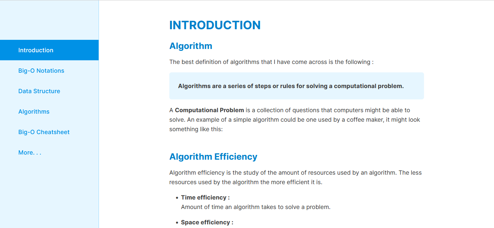
    </td>
    <td>
      
02

      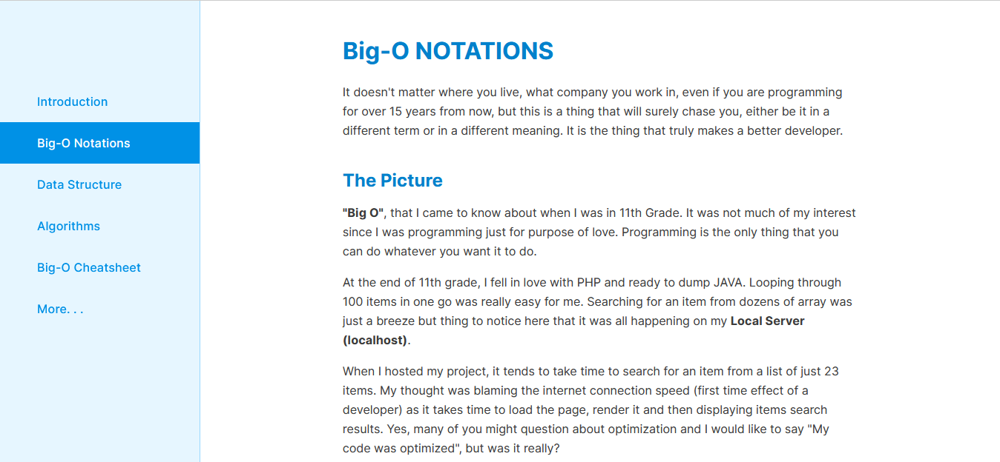
    </td>
  </tr>
  <tr>
    <td>
      
03

      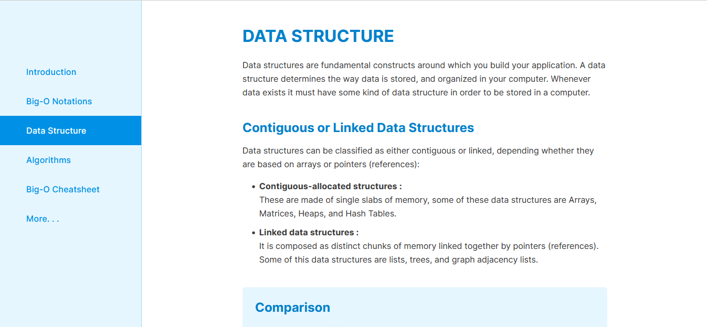
    </td>
    <td>
      
04

      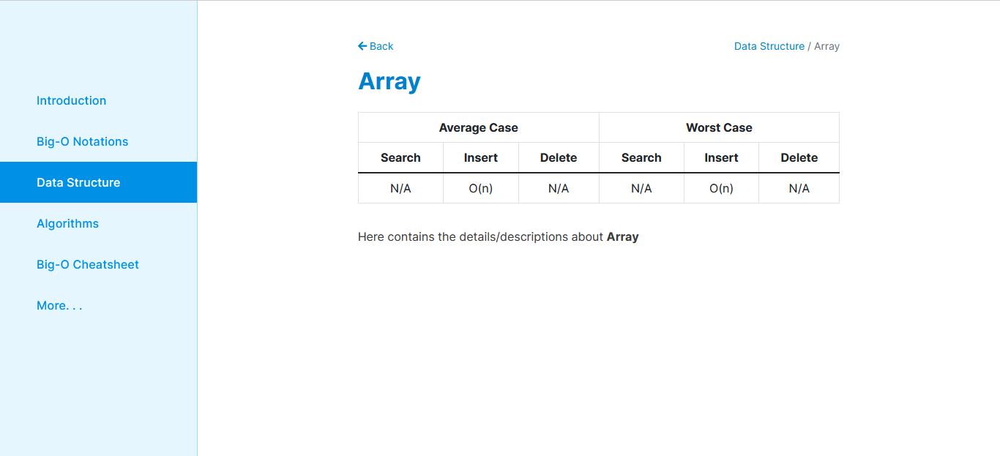
    </td>
  </tr>
  <tr>
    <td>
      
05

      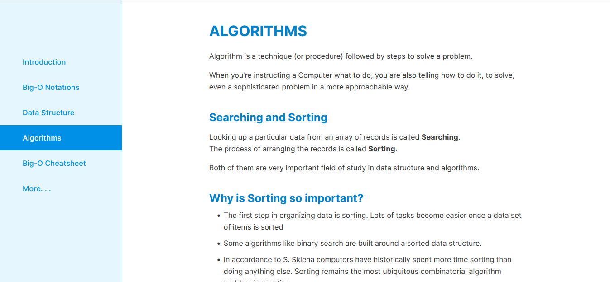
    </td>
    <td>
      
06

      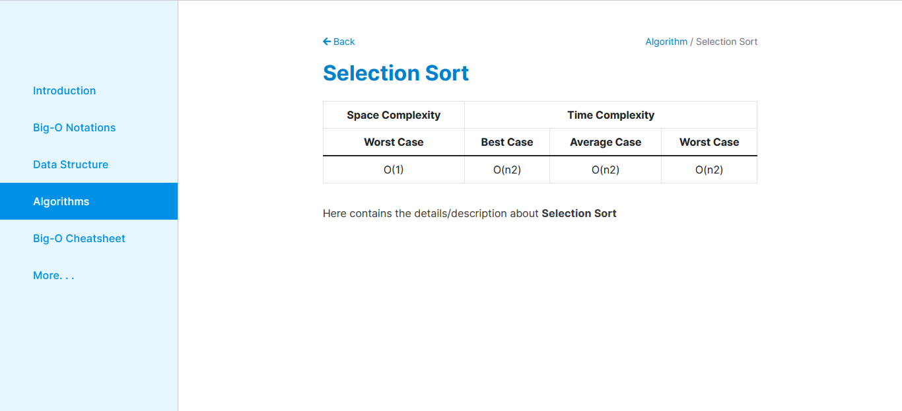
    </td>
  </tr>
  <tr>
    <td>
      
07

      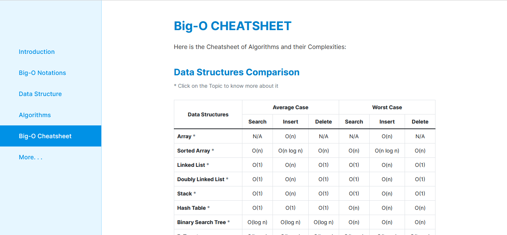
    </td>
    <td>
      
08

      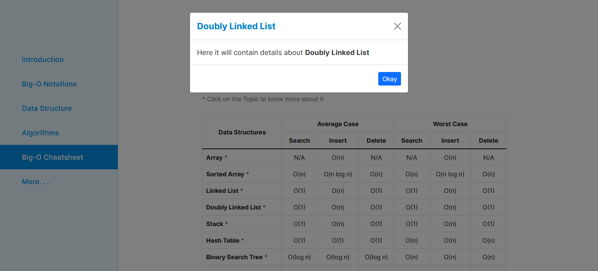
    </td>
  </tr>
</table>

## Project Screenshots (Mobile View)
<table>
  <tr>
    <td>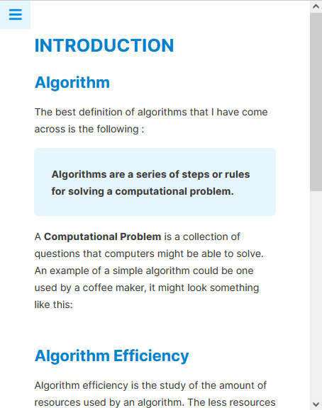</td>
    <td>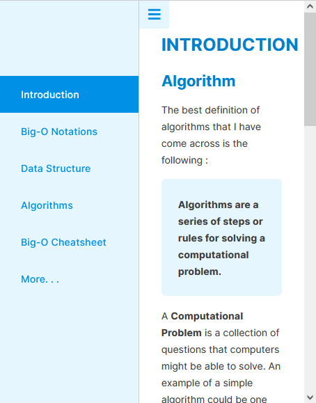</td>
  </tr>
</table>

## Thanks :)
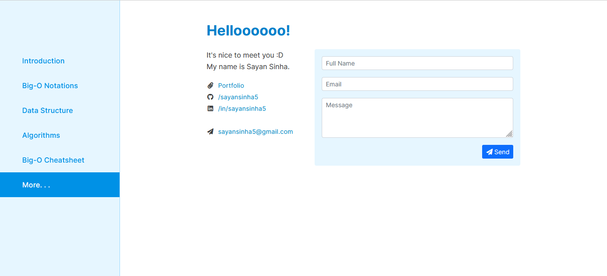
